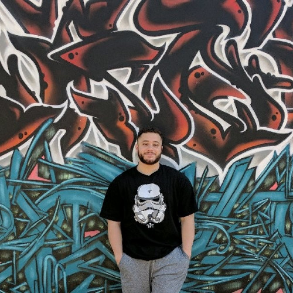
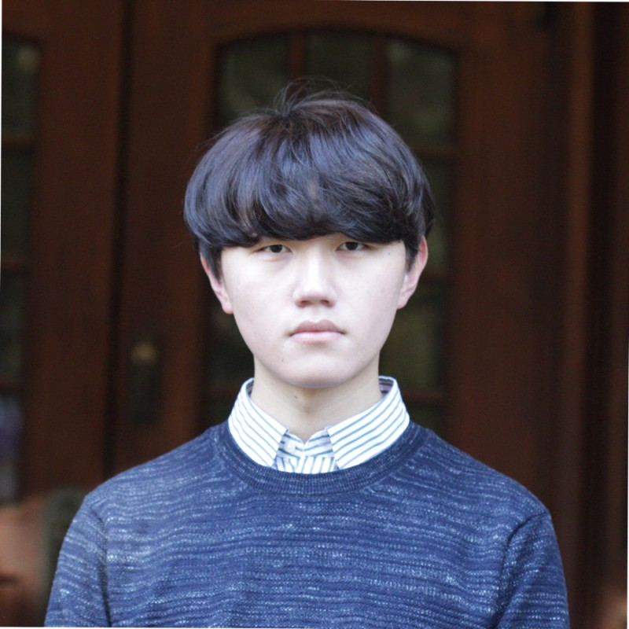
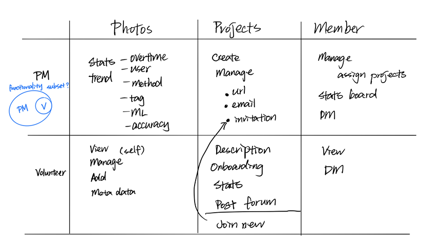
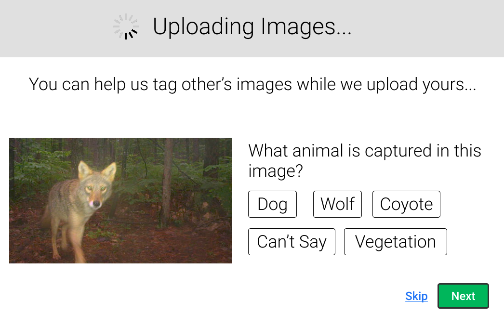

# INFO490-Capstone-GreenDubs
Climate change and environmental issues are arguably the biggest challenges of our era. At GreenDubs We believe that the solution to the environmental crisis can be addressed through a sustained localized community action that involves all of Humanity. An important problematic gap we have identified is that the current platforms and technologies available to citizen science communities/organizations pose a significant challenge to the volunteers due to a lack of effective human-centered design principles. We aim to create a web-based platform that allows for easier data upload, curation, and overall citizen science experience.

**Team members**

Divit Jawa: divitj@uw.edu

Liam Albright: liamaw@uw.edu

John Tumenbayar: tumenk@uw.edu

Rhea Chen: xinyuc2@uw.edu

## One line description 

Our platform creates a space for community to engage and collaborate in research that can ultimately help us fight climate change.

## Why you should care
the world is literally on fire, everywhere. 

## Solution drafts

# collaborators

Turam Purty

Ashish Anand

Vashon Nature Centre(VNC)

COASST at UW

This project is a part of the Capstone Project course at the University of Washington Information School 